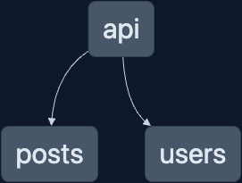

# Nx + Fastify + MongoDB

[](https://nx.dev/concepts/integrated-vs-package-based#integrated-repos)

> Note: The patterns described below work with standalone workspaces as well.

A [Fastify](https://www.fastify.io/) API using [MongoDB](https://www.mongodb.com/) in an Nx integrated workspace.

## What's inside?



The project is comprised of 3 projects

1. Fastify API
1. Users library
1. Posts Library

The `users` and `posts` library contain their respective route handlers and database access. The two libraries are then registered with the main `api` project in the [`app.ts`](./apps/api/src/app/app.ts#L30).

### Workspace from scratch

```shell
npx create-nx-workspace@latest
✔ Where would you like to create your workspace? · fastify-mongo
✔ Which stack do you want to use? · node
✔ What framework should be used? · fastify
✔ Standalone project or integrated monorepo? · integrated
✔ Application name · api
✔ Would you like to generate a Dockerfile? [https://docs.docker.com/] · No
✔ Enable distributed caching to make your CI faster · No
```

Add the `@fastify/mongodb` dependency.

```shell
npm i @fastify/mongodb
```

Use `@nx/node:library` generator to create a library for each feature route.

```shell
nx g lib <lib-name> --minimal --simple-name --unitTestRunner=none
```

Export a function to register the routes in the library, and use that function in the fastify app.

```ts
// in library
export async function registerRoutes(fastify: FastifyInstance) {
  // register routes
}

// in apps app.ts
fastify.register(registerRoutes);
```

## How to run it

> Note: MongoDB is required to run. This example use [Docker](https://www.docker.com/products/docker-desktop/) to run a local instance. You're welcome to use your preferred way to running a MongoDB instance. A connection string is all that is needed.

1. Clone the Repo
1. Install dependencies, `npm i`
1. Rename .env.example to .env, `cp .env.example .env`
   - Add the db connection string to the .env file if using your own database
1. If using Docker to run the database, run `npm run db` to start the DB
1. Start the api, `npm start`

All endpoints for the example are:

You can use the [Postman Collection](./extras/Nx_Fastify_Mongo.postman_collection.json) as well

- `GET /user`
  - Get All Users
- `GET /user/:id`
  - Get User
- `GET /user/:id/posts`
  - Get User Posts
- `POST /user`
  - Create User
  - Body contents: `{ email: string, name: string }`
- `DELETE /user/:id`
  - Delete User
- `GET /post/:id`
- `POST /post`
  - Create Post
  - Body Contents: `{ userId: string, title: string, content: string }`
- `DELETE /post/:id`
  - Delete Post

## Learn more

- [Nx](https://nx.dev)
- [Fastify](https://www.fastify.io/docs/latest/)
- [MongoDB](https://www.mongodb.com/docs/manual/crud/)
