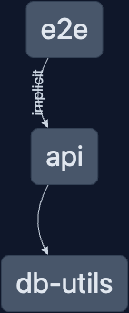

# Nx + Fastify + Postgres

[](https://nx.dev/concepts/integrated-vs-package-based#standalone-applications)

A starting point for using [Fastify](https://www.fastify.io/) with [Postgres](https://www.postgresql.org/)

## What's inside?

This example has 2 main Nx projects. A [Fastify api](./project.json) and some utilities to work with a [Postgres database](./db/utils/project.json)



This example also has a [Postman Collection](./extras/Nx_Fastify_Postgres.postman_collection.json) to make it easier to interact with the API.

To make this project yourself, you can start with [create-nx-workspace](https://www.npmjs.com/package/create-nx-workspace) and using the node standalone option.

```shell
npx create-nx-workspace@latest

✔ Choose what to create                 · node-standalone
✔ Application name                      · api
✔ What framework should be used? · fastify
✔ Would you like to generate a Dockerfile? [https://docs.docker.com/] · No
✔ Enable distributed caching to make your CI faster · No
```

The utility project is generated with the [@nx/js:lib](https://nx.dev/packages/js/generators/library) generator

```shell
nx g @nx/js:lib utils --unitTestRunner=none --bundler=none --minimal --simple-name --directory=db
```

> Tip: You can use the `--dry-run` flag to preview what files change!

## How to run it

> Note: A Postgres DB is required to run. This example use [Docker](https://www.docker.com/products/docker-desktop/) to run a local instance. You're welcome to use your preferred way to running a Postgres DB. A connection string is all that is needed.

1. Clone the Repo
1. Install dependencies, `npm i`
1. Rename .env.example to .env, `cp .env.example .env`
   - Add the db connection string to the .env file if using your own database
1. If using Docker to run the database, run `npm run db` to start the DB
1. Start the api, `npm start`
1. Setup the database by visiting [http://localhost:3000/reset](http://localhost:3000/reset)
   - or use the [Postman Collection](./extras/Nx_Fastify_Postgres.postman_collection.json) _Reset DB_ request

All endpoints for the example are:

- [GET /reset](./src/app/routes/posts.ts#L5)
  - Reset DB with empty tables
- [GET /api/posts](./src/app/routes/posts.ts#12)
  - Get all posts
- [GET /api/posts/:id](./src/apps/routes/posts.ts#L17)
  - Get post by ID
- [POST /api/posts](./src/app/routes/posts.ts#L26)
  - Create post
- [POST /api/users](./src/app/routes/users.ts#L7)
  - Create user

## Learn more

- [Build Node Apps w/ Nx](https://www.youtube.com/watch?v=LHLW0b4fr2w)
- [Fastify Docs](https://www.fastify.io/docs/latest/Guides/Database/)
