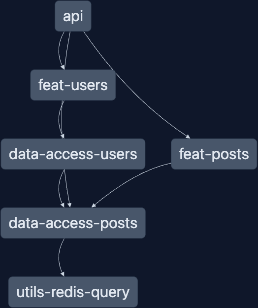

# Nx + Fastify + Redis

[](https://nx.dev/concepts/integrated-vs-package-based#integrated-repos)

A monorepo using with a [Fastify](https://www.fastify.io/docs/latest/) api with [Redis Stack](https://redis.io/docs/stack/about/) datastore

## What's inside?

Outline the structure of the example, the relevant part people should go and look at etc.

1. an API project using Fastify
   - `apps/api`
1. 2 feature libraries that create routes for the fastify api
   - `libs/feat-posts` and `libs/feat-users`
1. 2 data access libraries that use the `@fastify/redis` plugin to query Redis
   - `libs/data-access-posts` and `libs/data-access-users`
1. 1 Util library for working with Redis
   - `libs/util-redis-query`



## How to run it

This project requires a [Redis Stack Server](https://redis.io/docs/stack/use-cases/) with [RediSearch](https://redis.io/docs/stack/search/) installed. If you have [Docker](https://www.docker.com/products/docker-desktop/) installed, running `npm run db` will start an instance for you. Optionally, using [Redis Cloud](https://redis.com/try-free/)

The installed version uses [redis/redis-stack docker image](https://redis.io/docs/stack/get-started/install/docker/#redisredis-stack) which contains a web version of [RedisInsight](https://redis.com/redis-enterprise/redis-insight/) which can be helpful for local development and debugging of Redis.

1. Clone the repo
1. Install dependencies (`npm i`)
1. Start Redis instance (`npm run db`)
1. Serve the API (`npx nx serve api`)
   - `npx nx serve api | npx pino-pretty` to make logs more human readable.

You can use the provided [Postman Collection](./extras/Nx_Fastify_Redis.postman_collection.json) to explore the api, or use what you're most comfortable making requests to APIs

The API endpoints include

- `GET /` - Feed of posts
- `GET /count` - Increment a counter in redis
- `GET /search` - Search posts
  - `?q=<query>`
- `POST /post` - Create Post
  - Request Body `{ content: string, username: string }`
- `GET /post/:id` - Get Post By ID
- `POST /user` - Create User
  - Request Body `{ username: string }`
- `GET /user/:username/feed` - Get feed of posts from a user

There routes are registered in 3 locations.
the `/` and `/search` are in the apis [`routes/root.ts`](./apps/api/src/app/routes/root.ts) file.

Then each feature library ([`feat-users`](./libs/feat-users/src/index.ts), [`feat-posts`](./libs/feat-posts/src/index.ts)) export a route function, which is registered in the api [`app.ts`](./apps/api/src/app/app.ts).

The feature based libraries are not required and their routes could be configured directly inside the api project.
This project has the routes in separate projects mainly to show the discrete parts of the project. The same can also be said about using the redis client inside separate `data-access-*` libraries.
It's personal/organizational preference as to how things are structures.

### RediSearch

The library makes use of the [RedisSearch](https://redis.io/docs/stack/search/) module, this powers the `/search?q=<query>` endpoint.

When the API starts up the search index is initialized if it doesn't exist, see [`postRoutes`](./libs/feat-posts/src/index.ts#10).
When indexing a large amount of records this could take extra resources so be careful blocking the API start like this.
For this example it is fine as first start there will be no records, and for subsequent start ups the index will already be created

Since the `@fastify/redis` plugin does not have methods for the newer Redis stack modules, the `.call` method is used to directly run Redis commands.

```ts
const queryResults = await fastify.redis.call('FT.INFO', 'postIndex');
```

You can provide your own client to `@fastify/redis` when registering the plugin if you wish.

```ts
import fp from 'fastify-plugin';
import redis from '@fastify/redis';
import myCustomClient from 'alt-redis-client';

export default fp(async function (fastify: FastifyInstance) {
  fastify.register(redis, {
    client: myCustomClient,
  });
});
```

## Learn more

- [Fastify w/Postgres](https://github.com/nrwl/nx-recipes/tree/main/fastify-postgres#readme)
- [`@nx/node` plugin](https://nx.dev/packages/node/documents/overview)
- [Fastify Docs](https://www.fastify.io/docs/latest/)
- [Redis Stack Docs](https://redis.io/docs/stack/about/)
- [Redis in 100s](https://www.youtube.com/watch?v=G1rOthIU-uo)
