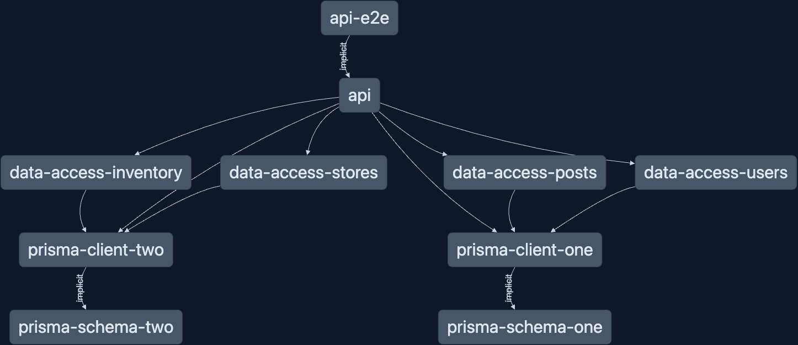

# Nx + NestJs + Prisma

[](https://nx.dev/concepts/integrated-vs-package-based#integrated-repos)

> Note: The same pattern described below can work for standalone apps as well

This example serves as a starting point for using [NestJs](https://nestjs.com) and [Prisma](https://prisma.io) in an [Nx workspace](https://nx.dev)

## What's inside ?

This repo contains 1 API project using NestJS using 2 different Prisma schema files in a single api project.



The important pieces of this example is how to setup Prisma schemas to work inside a monorepo, and how to leverage `@nx/nest` generators to quick setup an API with Prisma and NestJS.

## How to run it

1. Clone the repo
1. Install dependencies (`npm i`)
1. Rename `.env.example` to `.env` (`cp .env.example .env`)
1. Run prisma migrations (`nx run-many -t migrate`)
1. `nx serve api`

You can use the provided [Postman collection](./extras/Nx_NestJS_Prisma_Example.postman_collection.json) to interact with the api or use your preferred client to interact with the api.

## Prisma in a Monorepo

In order to use multiple sources with Prisma, You'll have to set a custom output path in each schema file nesting the generated output in the `@prisma/client` node_modules.

i.e.

```
// prisma.schema
generator client {
  provider = "prisma-client-js"
  output   = "<path-to-node_modules>/node_modules/@prisma/client/<some-custom-name>"
}
```

You can see this used in the [prisma-schema-one](./libs/prisma-schema-one/prisma/schema.prisma) and [prisma-schema-two](./libs/prisma-schema-two/prisma/schema.prisma) schema files.

## Prisma Schemas in Nx Library

To create a library for hosting a Prisma Schema you can use the [`@nx/js:lib`] generator.

```shell
nx g @nx/js:lib my-prisma-schema --unitTestRunner=none --bundler=none --simple-name --minimal
```

After generating, delete the `src` folder and add a `prisma/schema.prisma` file in the project root.

You can refer to the [Prisma schema docs](https://www.prisma.io/docs/reference/api-reference/prisma-schema-reference) for a complete reference. In this example, a minimal config is used and sqlite was chosen for simplicity.

### Run Prisma with Nx

It's helpful to add a target in the `project.json` to run Prisma. The important part is to make sure the `cwd` is set the project root (where the `project.json` is located), so Prisma can auto find the schema.

```json
{
  "targets": {
    "prisma": {
      "command": "prisma",
      "options": {
        "cwd": "<path-to-library-root>"
      }
    },
    "migrate": {
      "command": "prisma migrate dev",
      "options": {
        "cwd": "<path-to-library-root>"
      }
    }
    "generate-types": {
      "command": "prisma generate",
      "options": {
        "cwd": "<path-to-library-root>"
      }
    }
  }
}
```

You can invoke the targets via `nx <project-name>:<target-name> [rest of args]`

```shell
nx run my-prisma-schema:migrate
nx run my-prisma-schema:generate-types
nx run my-prisma-schema:prisma format
```

When multiple schema projects are setup, you can leverage [run-many](https://nx.dev/packages/nx/documents/run-many#run-many).

```shell
# generate types for all Prisma schemas
nx run-many --target generate-types
```

An example can been in the [prisma-schema-one](./libs/prisma-schema-one/project.json) and [prisma-schema-two](./libs/prisma-schema-two/project.json) project.json files.

## NestJS Prisma Clients

Using [@nx/nest:lib](https://nx.dev/packages/nest/generators/library) generator to create a library that houses a service to be used within NestJS framework. These are the [prisma-client-one](./libs/prisma-client-one/) and [prisma-client-two](./libs/prisma-client-two/) projects.

```shell
nx g @nx/nest:lib my-prisma-client

```

> Note: If you plan to only use NestJS then you can place the schema inside the same library as the NestJS Prisma service class.

The service extend the Prisma generated client and implement the NestJS `OnModuleInit` interface.

```ts
import { INestApplication, Injectable, OnModuleInit } from '@nestjs/common';
import { PrismaClient } from '@prisma/client/<genearted-output-from-schema-file>';

@Injectable()
export class PrismaService extends PrismaClient implements OnModuleInit {
  async onModuleInit() {
    await this.$connect();
  }
}
```

You can also reexport the generated Prisma types for NestJS if you wish in the projects public api `index.ts` file

```ts
// other exports in libs index.ts
export { Prisma, <any other generated types> } from '@prisma/client/<generated-name-space>';
import { PrismaService } from './lib/src/prisma.service.ts'
```

## Using NestJS Prisma Client

The Prisma client library are then used inside each data-access library where desired. For this example,
`prisma-client-one` is used within [data-access-posts](./libs/data-access-posts/src/lib/post.service.ts) and [data-access-users](./libs/data-access-users/src/lib/user.service.ts).
`prisma-client-two` is used within [data-access-inventory](./libs/data-access-inventory/src/lib/inventory.service.ts) and [data-access-stores](./libs/data-access-stores/src/lib/stores.service.ts).

These are also generated with the `@nx/nest:lib` generator.

```shell
nx g @nx/nest:lib data-access-<entity>
```

These libraries are able to leverage the generated clients that Prisma gave us, You would also add any extra business logic here for you application. This example only has the DB calls where to keep it understandable.

## Combining Datasources in the App

In the [api](./apps/api/) project, the [`app.controller.ts`](./apps/api/src/app/app.controller.ts) is where all the data-source libraries are imported and used.

> In a real world application, you'd have multiple controllers and not all located in a single controller. This example is focused on the Prisma setup and kept it simpler with just 1 controller.

## Learn more

- [Nx Nest Plugin](https://nx.dev/packages/nest/documents/overview)
- [Nx JS Plugin](https://nx.dev/packages/js/documents/overview)
- [Prisma Docs](https://www.prisma.io/docs)
- [Other Nx Recipes](https://nx.dev/recipes)
